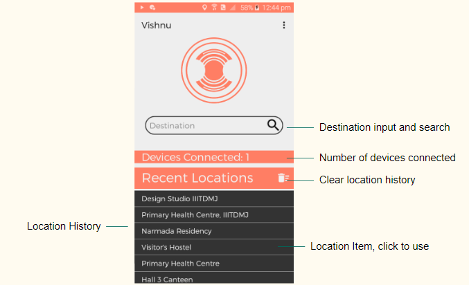
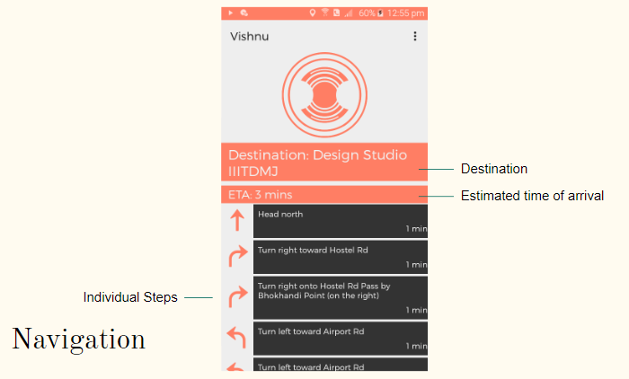
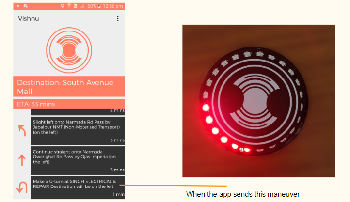
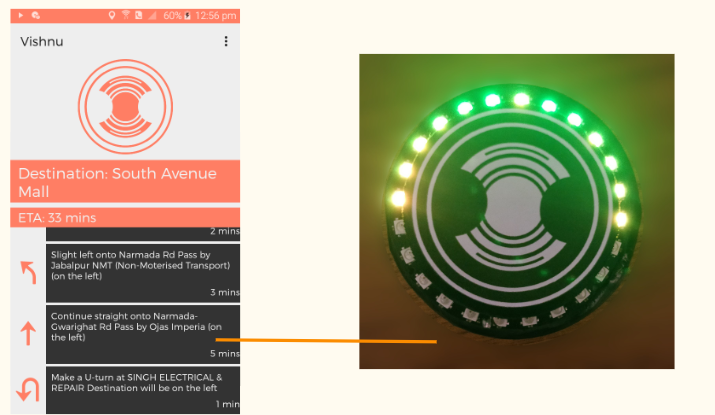

# Vishnu
VISHNU is a visual and haptic feedback based navigationsystem which provides only the necessary information to therider while on road.
It connects to the user’s mobile phone and is operated via anapplication.
It provides directions in real time, with the haptic units vibrat-ing on the waist and the Visual Unit on the vehicle.

VISHNU consists of two parts:

The first one is a visual unit with an LED ring to provide direc-tions. The user can mount it on the fuel tank or the handle-bars of the vehicle.

The second part is the haptic unit, which consists of two clipon devices for the user to mount on their waist. These givesubtle but effective vibrations on the sides of the waist when-ever there is a turn.

VISHNU is supported by a mobile application which sends it the required information. The
user only has to enter their destination and the app brings them the directions. The basic UI
of the app is as follows.

